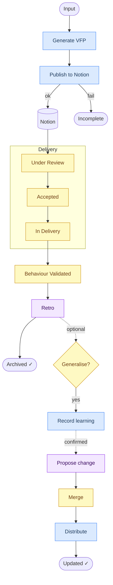

# vfp-agent

Delivery teams consistently underestimate requests — not because they lack information, but because they frame them in implementation terms before understanding the behaviour they are trying to change. A ticket that says "add booking system" conceals who does what, what changes in their world, what uncertainty exists, and what the smallest meaningful thing to validate would be.

`vfp-agent` intervenes at the framing stage. It generates **Value Framing Packets (VFPs)** — structured artefacts that expose behavioural intent, surface assumptions, bound uncertainty, and define the smallest meaningful validation slice before work starts. After delivery, it guides retrospectives that close the packet lifecycle and feed learning back into the methodology.

It is not a requirements tool. It is not a spec generator. It is a behavioural framing instrument.

Installs to **7 AI tools** via a single interactive installer. No npm runtime dependencies.

---

## Prerequisites

- **Node.js ≥ 24** — required by the installer
- **GitHub CLI (`gh`)** — required to fetch issues from private repositories as VFP input. For public repositories, the agent can fall back to webfetch, but `gh` is recommended in all cases (avoids rate limits, handles comments and labels). Install: https://cli.github.com

---

## Flow



**Blue** = agent &nbsp; **Yellow** = human &nbsp; **Purple** = both

**Solid** = required path. &nbsp; **Dashed** = optional.

Publishing to Notion is required — an unpublished packet is incomplete. The core agent is updated only when a pattern is confirmed across multiple independent packets.

---

## Install

### From the web (recommended)

```bash
curl -fsSL https://raw.githubusercontent.com/jgleal/vfp-agent/main/install.sh | bash
```

### From a local clone

```bash
git clone https://github.com/jgleal/vfp-agent
node vfp-agent/bin/install.js
```

### Interactive TUI

Running without flags opens an **interactive TUI selector**. Detected tools are pre-selected and shown first. Use arrow keys to move, `space` to toggle, `a` to select/deselect all, `enter` to confirm, `q` to quit.

```
vfp-agent installer

Available tools:
  > [✓] opencode detected
    [✓] Claude Code detected
    [✓] Cursor detected
    [ ] Gemini CLI (not detected)
    [ ] OpenAI Codex CLI (not detected)
    [✓] VS Code (Copilot) detected
    [ ] Windsurf (not detected)

↑/↓ move  space toggle  a all/none  enter confirm  q quit
```

### Installer flags

```
--all                  Install to all detected tools without prompting
--only <id>            Install only to the specified tool (repeatable)
--list                 List all supported tool IDs and exit
--dry-run              Show what would happen without making changes
--force                Overwrite existing files
--uninstall, -u        Remove installed files
--non-interactive      Skip all prompts (CI/automation)
--no-color             Disable ANSI output
--help, -h             Show help
```

### Uninstall

```bash
node bin/install.js --uninstall
```

Or for a specific tool:

```bash
node bin/install.js --only opencode --uninstall
```

### Manual installation — ChatGPT (Custom GPT)

The VFP agent can be configured as a **Custom GPT** on ChatGPT. This is a manual web process, not covered by the CLI installer.

1. Go to [chat.openai.com](https://chat.openai.com) → **Explore GPTs** → **Create**
2. In **Instructions**, paste the contents of [`agents/vfp.md`](agents/vfp.md) (everything after the `---` frontmatter block)
3. Set a name and description
4. To enable Notion publishing, add a **Custom Action**:
   - Import the Notion OpenAPI spec from `https://developers.notion.com/page/openapi`
   - Set authentication to API Key (`Bearer <your-token>`)
   - Enable the `search`, `createPage`, and `appendBlockChildren` operations
5. Save and share

Note: Notion pages must be explicitly shared with your integration for the agent to access them.

---

## Supported tools

| Tool | Agent destination | Notes |
|------|-------------------|-------|
| **opencode** | `~/.config/opencode/agents/vfp.md` | Native agents support |
| **Claude Code** | `~/.claude/agents/vfp.md` | Native agents support |
| **Cursor** | `~/.cursor/agents/vfp.md` | Native agents support |
| **Gemini CLI** | `~/.gemini/agents/vfp.md` | Native agents support |
| **OpenAI Codex CLI** | `~/.codex/agents/vfp.md` | Native agents support |
| **VS Code (Copilot)** | `~/.copilot/agents/vfp.agent.md` | GitHub Copilot agents |
| **Windsurf** | `~/.codeium/windsurf/memories/global_rules.md` | Appended as a fenced block; no agents dir |

---

## Notion MCP setup

The VFP agent publishes artefacts to Notion and can update existing VFP pages during retrospectives. The installer checks whether the Notion MCP server is configured for each selected tool. If not, it prompts once for a Notion integration token and patches the relevant config file automatically.

**Get a token:** https://www.notion.so/my-integrations → create an integration → copy the token (`ntn_...`).

The token is written into the tool's MCP config (e.g. `opencode.json`, `~/.claude/settings.json`, `~/.cursor/mcp.json`). You only need to enter it once — it is reused across all tools installed in the same session.

### Notion MCP config locations

| Tool | Config file |
|------|-------------|
| opencode | `~/.config/opencode/opencode.json` |
| Claude Code | `~/.claude/settings.json` |
| Cursor | `~/.cursor/mcp.json` |
| VS Code | `~/Library/Application Support/Code/User/mcp.json` (macOS) |
| Windsurf | `~/.codeium/windsurf/mcp_config.json` |

Gemini CLI and Codex CLI MCP config formats are not yet standardised — configure Notion MCP manually for those tools.

---

## How the agent works

### Generating a VFP

Invoke with: *"generate a VFP"*, *"frame this request"*, *"create a value framing packet"*, or *"help me structure this delivery"*.

The agent interprets the **behavioural intent** behind the request — not its implementation. It detects uncertainty signals, generates all **17 sections** in order, and requires publishing the result to Notion before the packet is considered complete. A packet that has not been published is in Draft state and incomplete.

The agent is not a requirements analyst, not a technical architect, not a project manager. If a generated VFP reads like a PRD or a technical spec, it has failed.

### Publishing to Notion

When you confirm you want to publish, the agent:

1. Calls the Notion MCP to list accessible pages and presents them numbered
2. You pick a target page
3. The VFP is created as a new child page titled `VFP — [description] — [date]` with all 17 sections as structured blocks
4. The agent returns the page URL

### Running a retrospective

After a VFP reaches `Behaviour Validated`, invoke the retrospective flow with: *"run a retro on this VFP"*, *"help me fill the validation outcome"*, or *"this has been delivered, let's capture learnings"*.

The agent walks you through filling section 4.18 (Validation Outcome), updates the VFP in Notion, and optionally extracts learning entries. If an extracted learning confirms a prior `watching` pattern, the agent produces a **Level 3 draft** — a ready-to-apply diff and PR description targeting the relevant methodology doc. The human reviews it, opens a PR, and anyone with the agent installed can run `--update` to receive the merged change.

See [`methodology/retro-procedure.md`](methodology/retro-procedure.md) for the full procedural guide.

### VFP status lifecycle

```
Draft → Under Review → Needs Rework → Accepted for Exploration → In Delivery → Behaviour Validated → Archived Learning
```

`Behaviour Validated` is the retro trigger. `Archived Learning` closes the packet lifecycle. See the [Flow](#flow) diagram above for how the retrospective connects to optional learning extraction and core agent updates.

---

## Repo structure

```
agents/vfp.md          ← single source of truth (opencode frontmatter format)
bin/install.js         ← installer: reads agents/vfp.md, transforms frontmatter per tool
install.sh             ← curl-pipeable bash shim → delegates to bin/install.js via npx
methodology/           ← canonical reference documents and operational logs
```

The installer applies `transformContent()` at write time — the prompt body is never duplicated. Only the frontmatter header differs per tool:

| Tool | Frontmatter written |
|------|---------------------|
| opencode | source format (`mode: all`) |
| Claude Code | `name` + `description` only |
| Cursor / Gemini / Codex | `description` only |
| VS Code | `description` + `user-invocable: true` |
| Windsurf | no frontmatter — appended as plain block to `global_rules.md` |

---

## Methodology docs

The [`/methodology`](methodology/) directory contains the canonical reference documents and operational logs this agent is built on:

- [`core-methodology.md`](methodology/core-methodology.md) — AI-Native Delivery & Value Framing core principles (incl. evidence collection, evaluation, and retro-feedback loop)
- [`vfp-guide.md`](methodology/vfp-guide.md) — full 17-section VFP template reference + post-delivery Validation Outcome (§4.18)
- [`capability-slicing.md`](methodology/capability-slicing.md) — behavioural slicing patterns
- [`risk-uncertainty.md`](methodology/risk-uncertainty.md) — uncertainty classification and risk signal detection
- [`pilot-operational-model.md`](methodology/pilot-operational-model.md) — pilot operating model: roles, ceremonies, cadence, escalation
- [`validation-evidence-patterns.md`](methodology/validation-evidence-patterns.md) — evidence collection patterns for behavioural validation
- [`example-library.md`](methodology/example-library.md) — worked VFP examples (grows through operational learning)
- [`retro-procedure.md`](methodology/retro-procedure.md) — step-by-step retrospective procedure: when to raise, what to update, how learnings are stored
- [`learnings.md`](methodology/learnings.md) — running log of confirmed patterns extracted from VFP validation outcomes

---

## License

MIT
